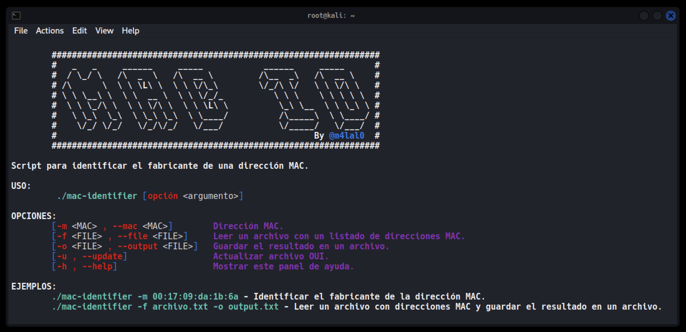

# MAC-identifier
<p align="center">
Script hecho en Bash para identificar el fabricante de una dirección MAC.
</p>

## Instalación
```bash
git clone https://github.com/m4lal0/mac-identifier
cd mac-identifier ; chmod +x mac-identifier.sh
./mac-identifier.sh
```

## ¿Cómo funciona la herramienta?
Tras ejecutar la herramienta, nos mostrará el panel de ayuda.

<p align="center">

</p>

La herramienta cuenta con 3 parámetros:

* -m ó --mac : Lee una dirección MAC.
    + Usamos el parametro **-m** ó **--mac** seguido como argumento la dirección MAC.

* -f ó --file :  Lee un archivo que tiene un listado de direcciones MAC.
    + Usamos el parametro **-f** ó **--file** seguido como argumento la ruta y nombre del archivo.

* -o ó --output : Guarda el resultado en un archivo.
    + Usamos el parametro **-o** ó **--output** seguido como argumento el nombre que queremos llamar a nuestro archivo.

* -u ó --update : Actualiza el archivo OUI.
    + Usamos el parametro **-u** ó **--update** para actualizar la herramienta.


> Al ejecutar por primera vez el script, descargará un archivo (OUI) que contiene listado de fabricantes para el correcto uso de la herramienta.